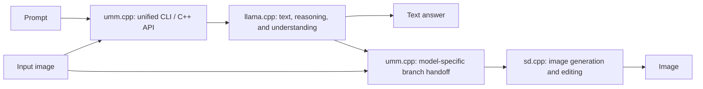

# umm.cpp

Unified multimodal inference in C++.

`umm.cpp` brings text and image generation together through a modular design:
[llama.cpp](https://github.com/ggml-org/llama.cpp) runs the text branch,
[stable-diffusion.cpp](https://github.com/leejet/stable-diffusion.cpp) (sd.cpp)
runs the image branch, and `umm.cpp` coordinates their interaction behind a
unified command-line interface and C++ API.

[Modular design](#modular-design) • [Supported models](#supported-models) •
[Platform support](#platform-support) •
[Quick start](#quick-start) • [C++ API](#c-api)

## Updates
- [ ] Performance measurement and NPU support
- [x] Sep 10: add BAGEL support.
- [x] Sep 9: Initial version is ready. It supports SenseNova U1 series model. It can do Text / Image / Text(reasoning)-then-Image generation.

## Modular design

The core idea is to keep each branch's computation in its dedicated inference
engine and handle the interaction between branches in `umm.cpp`.

| Component | Responsibility |
| --- | --- |
| **llama.cpp** | Understanding-branch execution and autoregressive text generation |
| **sd.cpp** | Image-generation branch execution, pixel-flow sampling, and image decoding |
| **umm.cpp** (this repo) | Model-specific prompt formatting, text/image phase sequencing, state transfer between branches, and a unified user interface |

SenseNova U1 and BAGEL both use a MoT structure that separates multimodal
inference into a language side and an image side, but they package the bridge
differently.
- U1 transfers the
understanding prefix's attention key/value (K/V) state from llama.cpp to sd.cpp.
- BAGEL uses llama.cpp for text, reasoning, and vision-token sequencing, then uses
sd.cpp for the diffusion branch with the BAGEL-specific latent/image handoff.
- This repo, `umm.cpp`, owns that model-specific sequencing so the public CLI and C++ API stay
consistent across models.



The design has three practical properties:

- Each engine owns the model graphs and kernels it executes.
- New model integrations reuse the shared layers and add their own prompt
  grammar, package components, and branch handoff rules.
- Both engines run in one process and share ggml, while each executes its own
  forward pass independently.

## Supported models

| Model family | Current support |
| --- | --- |
| [SenseNova U1 series](https://github.com/OpenSenseNova/SenseNova-U1) | Initial model family; the current implementation and validation cover the dense SenseNova U1.5 checkpoint |
| [BAGEL-7B-MoT](https://huggingface.co/ByteDance-Seed/BAGEL-7B-MoT) | Experimental implementation in the development working tree; conversion, CPU handoff tests, graph construction, and a small vision forward pass checked. Full inference and image quality are not yet validated. |
| Additional model families | Planned; Hunyuan Image is a likely next target |

The interface provides these modes:

| Mode | Output |
| --- | --- |
| `text` | Autoregressive text |
| `image` | An image conditioned on the prompt |
| `think-image` | Reasoning followed by an image |
| `understand`, `think-understand` | Answer a question about an input image |
| `edit`, `think-edit` | Edit an input image, optionally with reasoning |

## Platform support

Validation in this repository has been performed only on Linux with NVIDIA
CUDA. The current CUDA configuration runs both model branches on the GPU; CPU
handles supporting work such as tokenization and file I/O. Support for other
platforms and backends is future work.

## Quick start

### Build

You need Git, CMake 3.21 or newer, a C++17 compiler, and Python for model
conversion. The CUDA build also needs the CUDA toolkit.

From the repository root, initialize the pinned engines and build:

```sh
git submodule update --init third_party/llama.cpp third_party/stable-diffusion.cpp
python scripts/apply-patches.py
cmake -S . -B build -DCMAKE_BUILD_TYPE=Release -DGGML_CUDA=ON -DSD_CUDA=ON
cmake --build build -j 8
```

### Prepare a model package

`convert-model.py` accepts an official U1.5 or BAGEL checkpoint and creates the
self-contained directory consumed by `umm-cli`.

Install the converter dependencies once:

```sh
python -m pip install -r third_party/llama.cpp/requirements/requirements-convert_hf_to_gguf.txt
```

Convert a checkpoint with:

```sh
# SenseNova U1.5
python scripts/convert-model.py /path/to/official-u1.5 --output /path/to/u1

# BAGEL-7B-MoT
python scripts/convert-model.py /path/to/BAGEL-7B-MoT --output /path/to/bagel
```

The resulting package contains a `model.json` manifest and model-family-specific
components:

- U1: `understanding.gguf` and `generation.gguf`. The generation file also
  carries U1's native understanding vision encoder.
- BAGEL: `understanding.gguf`, `generation.gguf`, `vision.gguf`, and
  `vae.safetensors`.

Other package rules:

- Understanding weights default to BF16; use `--outtype f16`, `f32`, or `q8_0`
  to change that component's format.
- Generation weights retain their source dtype and values.
- Tokenizer data is embedded in `understanding.gguf`.
- The converter leaves the source checkpoint untouched, refuses to overwrite an
  existing output directory, and needs enough free space for the completed
  package beside the source checkpoint.

### Generate text

```sh
build/bin/umm-cli --model /path/to/u1 \
  --mode text --prompt 'What is 2 + 3?'
```

### Generate an image

```sh
build/bin/umm-cli --model /path/to/u1 --mode image \
  --prompt 'a red cube on a white background' --output cube.png
```

### Reason, then generate an image

```sh
build/bin/umm-cli --model /path/to/u1 --mode think-image \
  --prompt 'Design a clear illustration of the water cycle.' --output water-cycle.png
```

Image commands write a PNG and a companion `.png.json` file containing generation
settings, reasoning, and tokens. Defaults are 2048 × 2048, 50 Euler steps, guidance
4, flow shift 3, and seed 42. Use `--width`, `--height`, `--steps`, `--cfg`,
`--shift`, and `--seed` to adjust them; dimensions must be divisible by 32.
Run `build/bin/umm-cli --help` for all options.

Model-specific defaults:

- U1 image generation defaults to 2048 × 2048, with dimensions divisible by 32.
- BAGEL image generation defaults to 1024 × 1024, with dimensions divisible by 16
  and a maximum size of 1024 × 1024.
- For editing, omitting `--width` and `--height` preserves the prepared input
  dimensions. BAGEL also supports `--image-cfg`, which defaults to 1.5.
- All models use the same `umm-cli` modes and command format.

## C++ API

Use the same session interface for text and image generation:

```cpp
#include "session.h"

umm::session session("/path/to/u1");

auto text = session.text("What is 2 + 3?");

umm::image_options options;
options.think = true;
auto image = session.image("Design a clear illustration of the water cycle.", options);
// image.rgb contains RGB pixels; image.reasoning contains the preceding reasoning.
```

See [session.h](include/session.h) for the public interface and defaults.
