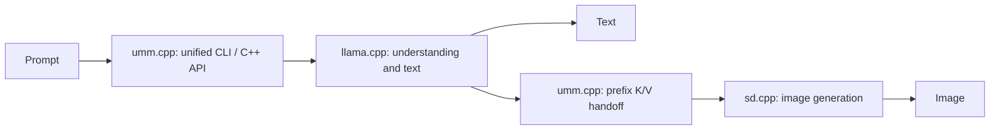

# umm.cpp

Unified multimodal inference in C++.

`umm.cpp` brings text and image generation together through a modular design:
[llama.cpp](https://github.com/ggml-org/llama.cpp) runs the text branch,
[stable-diffusion.cpp](https://github.com/leejet/stable-diffusion.cpp) (sd.cpp)
runs the image branch, and `umm.cpp` coordinates their interaction behind a
unified command-line interface and C++ API.

Initial model support is the **SenseNova U1 series**, starting with the dense
**SenseNova U1.5** checkpoint. **Support for additional models is on the way.**

[Modular design](#modular-design) • [Supported models](#supported-models) •
[Quick start](#quick-start) • [C++ API](#c-api) • [Documentation](#documentation)

## Modular design

The core idea is to keep each branch's computation in its dedicated inference
engine and handle the interaction between branches in `umm.cpp`.

| Component | Responsibility |
| --- | --- |
| **llama.cpp** | Understanding-branch execution and autoregressive text generation |
| **sd.cpp** | Image-generation branch execution, pixel-flow sampling, and image decoding |
| **umm.cpp** | Model-specific prompt formatting, text/image phase sequencing, state transfer between branches, and a unified user interface |

For SenseNova U1's **MoT architecture**, the text and image branches belong to
the same unified model. `umm.cpp` runs the understanding prefix and optional
reasoning through llama.cpp, then transfers the prefix's attention key/value
(K/V) state to sd.cpp to condition image generation.



This separation keeps model graphs and kernels in the engine that executes them.
New model integrations can build on those engines while adding the required
branch coordination to `umm.cpp`. Both engines run in one process and share ggml;
each engine executes its own forward pass independently.

## Supported models

| Model family | Current support |
| --- | --- |
| [SenseNova U1 series](https://github.com/OpenSenseNova/SenseNova-U1) | Initial model family; the current implementation and validation cover the dense SenseNova U1.5 checkpoint |
| Additional model families | Planned; support is on the way |

The current interface accepts text prompts and provides three output modes:

| Mode | Output |
| --- | --- |
| `text` | Autoregressive text |
| `image` | An image conditioned on the prompt |
| `think-image` | Reasoning followed by an image |

Image input and conversation continuation after image output are not yet
implemented. See the [runtime validation](docs/REFERENCE-CONTROLS.md) for the
tested cases.

## Quick start

### Build

You need Git, CMake 3.21 or newer, a C++17 compiler, and Python for model
conversion. The CUDA build also needs the CUDA toolkit.

From the repository root, initialize the pinned engines and build:

```sh
git submodule update --init third_party/llama.cpp third_party/stable-diffusion.cpp
cmake -S . -B build -DCMAKE_BUILD_TYPE=Release -DGGML_CUDA=ON -DSD_CUDA=ON
cmake --build build -j 8
```

For a CPU build, omit the CUDA options. The project currently uses integration
forks of both engines, pinned in [dependencies.json](dependencies.json). Normal
builds need no local patches or additional reference-test dependencies.

### Prepare the model

Download the official dense
[SenseNova U1.5 checkpoint](https://huggingface.co/sensenova/SenseNova-U1.5-8B-MoT)
and replace `/path/to/official-u1.5` below with its local directory. Install the
converter's dependencies in your Python environment, then create an understanding
GGUF for llama.cpp:

```sh
python -m pip install -r third_party/llama.cpp/requirements/requirements-convert_hf_to_gguf.txt
python third_party/llama.cpp/convert_hf_to_gguf.py /path/to/official-u1.5 \
  --outtype bf16 --outfile /path/to/u1-understanding-bf16.gguf
```

The image branch reads the original checkpoint directly and loads only its
generation weights. The understanding GGUF needs approximately 19 GB of disk
space, in addition to the original checkpoint and build files.

### Generate text

```sh
build/bin/umm-cli --text-model /path/to/u1-understanding-bf16.gguf \
  --mode text --prompt 'What is 2 + 3?'
```

### Generate an image

```sh
build/bin/umm-cli --text-model /path/to/u1-understanding-bf16.gguf \
  --image-model /path/to/official-u1.5 --mode image \
  --prompt 'a red cube on a white background' --output cube.png
```

### Reason, then generate an image

```sh
build/bin/umm-cli --text-model /path/to/u1-understanding-bf16.gguf \
  --image-model /path/to/official-u1.5 --mode think-image \
  --prompt 'Design a clear illustration of the water cycle.' --output water-cycle.png
```

Image commands write a PNG and a companion `.png.json` file containing generation
settings, reasoning, and tokens. Defaults are 2048 × 2048, 50 Euler steps, guidance
4, flow shift 3, and seed 42. Use `--width`, `--height`, `--steps`, `--cfg`,
`--shift`, and `--seed` to adjust them; dimensions must be divisible by 32.
Run `build/bin/umm-cli --help` for all options.

## C++ API

Use the same session interface for text and image generation:

```cpp
#include "umm/session.h"

umm::session session("/path/to/u1-understanding-bf16.gguf",
                     "/path/to/official-u1.5");

auto text = session.text("What is 2 + 3?");

umm::image_options options;
options.think = true;
auto image = session.image("Design a clear illustration of the water cycle.", options);
// image.rgb contains RGB pixels; image.reasoning contains the preceding reasoning.
```

The generation checkpoint is optional for text-only sessions. See
[session.h](include/umm/session.h) for the public interface and defaults.

## Documentation

- [Development guide](docs/DEVELOPMENT.md): source layout, cache handoff, shared
  ggml build, dependency updates, and numerical behavior.
- [Runtime validation](docs/REFERENCE-CONTROLS.md): normal inference and reference
  comparison results.
- [Reference tests](tests/reference/README.md): isolated builds for exact
  comparisons with recorded official outputs.
- [Integration commits](patches/README.md): changes carried by the engine forks.
- [Implementation plan](docs/PLAN.md): development milestones and design history.
